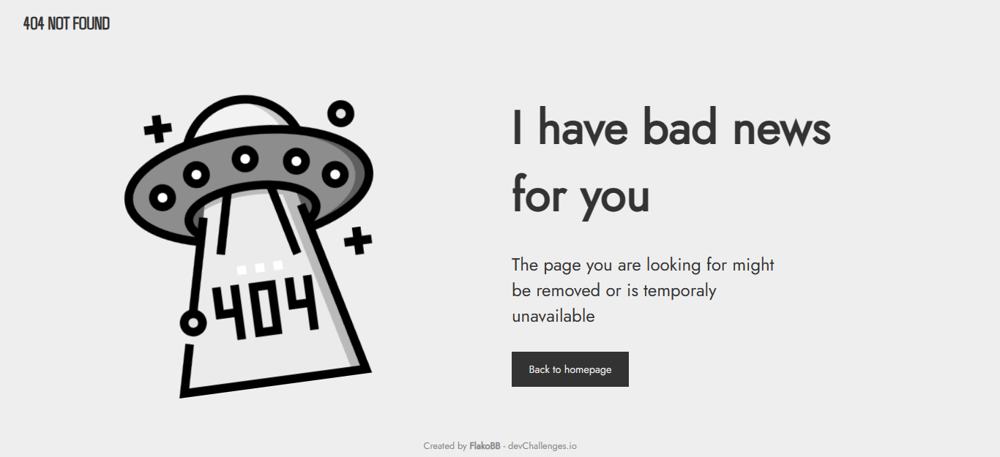

<h1 align="center">404 Not Found</h1>

   Solution for a challenge from  <a href="http://devchallenges.io" target="_blank">Devchallenges.io</a>.

  <h3>
    <a href="https://flakobb.github.io/404-not-found/">
      Demo
    </a>
     | 
    <a href="https://github.com/FlakoBB/404-not-found">
      Solution
    </a>
     | 
    <a href="https://devchallenges.io/challenges/wBunSb7FPrIepJZAg0sY">
      Challenge
    </a>
  </h3>

<!-- TABLE OF CONTENTS -->

## Table of Contents

- [Overview](#overview)
  - [Built With](#built-with)
- [Features](#features)
- [Contact](#contact)

<!-- OVERVIEW -->

## Overview

Con este proyecto puse en practica mis habilidades de HTML, CSS y JavaScript a traves de:

- Estructurar etiquetas semanticas de HTML
- Posicionamineto de elementos con CSS **flex** y **grid**
- Animaciones de CSS usando **@keyframes**
- Control de clases a elementos HTML desde JavaScript

### Built With

- HTML
- CSS
- JavaScript

## Features

This application/site was created as a submission to a [DevChallenges](https://devchallenges.io/challenges) challenge. The [challenge](https://devchallenges.io/challenges/wBunSb7FPrIepJZAg0sY) was to build an application to complete the given user stories.

## Contact

- Socials: [Follow me](https://bit.ly/follow-flako)
